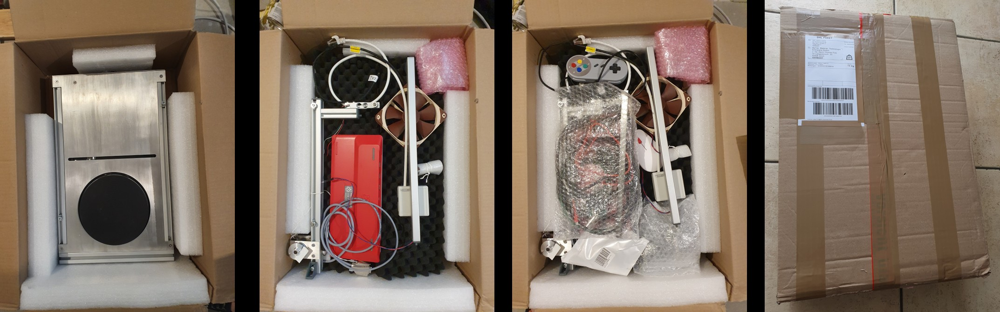

# educrys-hardware

Subfolders contain the documentation for [mechanical](/mechanical-design) and [electronic](/electronic-design) design of EduCrys setup for the users who want to build or adapt it by themselves.

The sections below provide information for users who have received a ready-to-use setup.

## Packing

While most electronic components of EduCrys are enclosed in a robust metallic box, many sensors and other parts need careful packing to avoid damage during transport. The pictures below show an example of such packing. The final package has dimensions of 60x43x23 cm and weight of 13.3 kg.

## List of components

### Main components

- Main body with all connectors detached, except the end of the camera cable, which is taped on the right wall. Two M6 screws are left in the profiles on both sides.
- Main stand with both motors and weight cell. The pulling wire is wound and taped on the motor roll.
- Second stand with the fan and the small sensor box. The infrared sensor and LED should be protected with bubble wrap.
- Seed holder with a rotation motor in a bubble wrap bag. Small S-shaped hook to attach the seed holder to the pulling wire.
- Aluminum crucible with solid tin (99.9%), in a bubble wrap bag, should not move around in the transport box.

### Sensors and cables

- Raspberry Pi camera with a cover, attached to a magic arm, all inside a bubble wrap
- 1x PT100 and 2x thermocouple sensors with about 1.5 m wire length
- Raspberry Pi keyboard incl. USB cable and mouse, gamepad
- HDMI monitor cable, power cable

### Tools

- 30 cm metallic ruler
- Small spoon and small metal blow to be used when removing oxide layer
- 3 Inbus key for seed holder, opening main body, and stand mounting
- Nylon wire, which can be used to temporarily replace the steel wire of the seed holder
- Warning sign for hot surfaces

### Raw material

- Thin tin crystal, which can be used as seed
- Thin copper wire, which can be used as seed
- (Tin pellets with 99.9% purity)

### Not included
- Protective glasses when working close to the crucible. **The hot liquid metal may splash if something falls into the melt!**
- Protective gloves when touching the hot crucible, for example, to adjust its position.
- Monitor
- Power strip

## Assembling the setup

### Mechanical

- Place the main body on a table with the logo on the front
- Attach the main stand on the left profile with a M6 screw, close to the front. Connect the motor and weight cell cables.
- Attach the fan stand on the right profile with a M6 screw, close to the back. Connect the fan and sensor cables.
- Guide the pulling wire over 3 pulleys from the pulling motor to the weight cell. Insert a hook in the loop at the wire end. Keep the wire tightened, otherwise it will unwind itself from the motor roll.
- Hang the seed holder on the hook. The tilt of the seed holder should remain adjustable in two perpendicular directions.
- Attach the cable with two pins to the rotation motor. The polarity is not important. Keep the free length of this cable sufficient during the motion of the seed holder. This cable prevents the seed holder from rotating, but it should not pull it away from the vertical axis.
- Place the crucible on the hotplate. Check that the seed holder is in the middle of the crucible. Adjust the main stand position if necessary.

### Sensors and cables

- Attach the magic arm with camera on the right profile, close to the front. Carefully pull out the camera cable from the slit in the right wall. Insert the cable end into the connector at the back of the camera with the conducting pins towards the board. Push the black connector part upwards to fix the cable.
- Insert the PT100 sensor in a horizontal borehole and one thermocouple in a vertical borehole of the crucible. Both sensor cables should be bound together to prevent the PT100 sliding out of the hole. **This would lead to strong overheating of the crucible during temperature-controlled heating!**
- The second thermocouple could be used to measure ambient air, melt, or some parts inside the main body.
- Connect the keyboard with the USB cable to the socket in the right wall. Connect the mouse and the gamepad to the keyboard. These USB ports can be also used to attach USB flash memory for data transfer.
- Connect a monitor to the HDMI socket in the right wall.
- Attach the power cable at the back of the main body. **Raspberry Pi starts as soon as power is connected! Always use the shutdown function in the Menu before disconnecting the power to avoid data loss.**
- If necessary, a network cable can be attached directly to the Raspberry Pi board through an opening in the back wall. Remove the screws and carefully pull the back wall for about 5 cm to access Raspberry Pi. **The network socket in the back wall can be only used for the sensor box.**
- Check the system clock after the log in. Newer EduCrys setups have a hardware clock with battery backup, while others rely on synchronization over network.

The final setup should look like this.

## Acknowledgements

[This project](https://poc-handsome.github.io/) has received funding from the European Research Council (ERC) under the 
European Union’s Horizon Europe framework programme for research and innovation (grant agreement No. 101122970).

