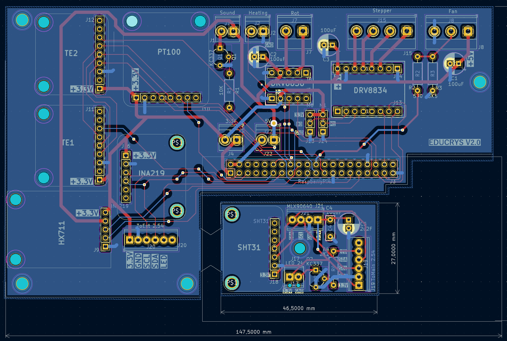
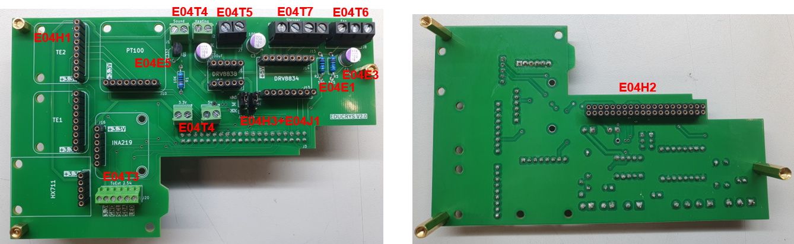
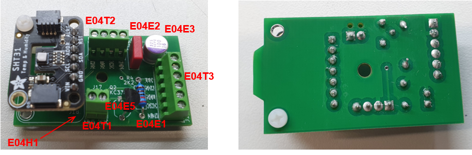
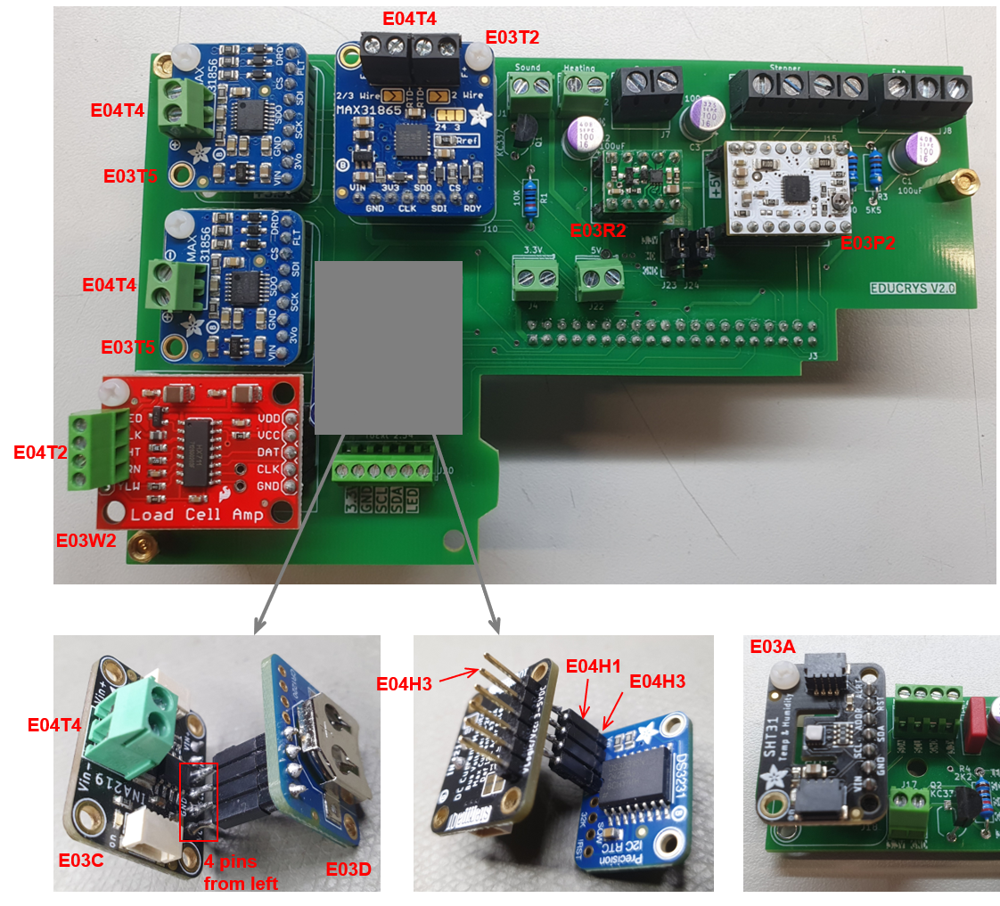

## E01 PCB

### Layout of the PCB

Design files for KiCad (8.0.0) are here: [KiCad]([/E01/KiCad/educrysV2.kicad_pcb](https://github.com/poc-handsome/educrys-hardware/tree/main/electronic-design/E01/KiCad))

The following improvements have not been implemented yet:
- Separate pin header for the clock module
- Larger screw terminal for the connection between main PCB and sensor PCB
- Avoid risk of short circuit when soldering capacitors

### Soldering

Main PCB with soldered parts, top and bottom views:

Sensor PCB with soldered parts, top and bottom views:

Remarks:
- The connection between the main board and sensor board must be cut 
- For all screw terminals the holes are oriented to the rim of the board 
- A small 2 mm gap should be left between the 100 uF capacitor to avoid short circuit 
- Resitor values are not printed correctly on the board, use closes E12 values
- All flux residues should be cleaned from both board sides, e.g. using Kontaktchemie LR

### Modules

PCB after mounting the modules:

Remarks:

- First solder pin headers [E04H3] on the bottom of all modules [E03T2 etc.]. Make short breaks to avoid overheating the chip
- Solder screw terminals on the top of modules [E03T5, E03T2, E03W2, E03C]. The holes are oriented to the center of the board for [E03T5, E03W2] and to the rim of the board for [E03T2, E03C]
- Solder a female header on the top of the module [E03C] (4 pins on the left) and connect the module [E03D] there
- All flux residues should be cleaned from both board sides, e.g. using Kontaktchemie LR
- The modules will be fastened later to the PCB with a 10 mm spacer and two M2.5 screws. M3 screws are too big!

## E02 Wiring diagram

Schematic of the connections using the parts given below:

(pic)

Photo of the final wiring

(pic)

Remarks:

## E03 Devices: sensors, actuators

Prices are given per one piece in EUR incl. VAT. 

| Part  | Description                             | Use               | Price | Vendor/Link              | Datasheet | 
|-------|-----------------------------------------|-------------------|-------|--------------------------|-----------|
| E03H  | Hotplate, Severin KP 1092               | Crucible heating  | 27.99 | [Conrad/704233](https://www.conrad.de/de/p/severin-kp-1092-1092-kochplatte-704233.html?searchType=SearchRedirect)       |           |
| E03P1 | Stepper, Nema-17 1:20                   | Crystal pulling   | 56.90 | [Conrad/2355877](https://www.conrad.de/de/p/joy-it-schrittmotor-nema17-07gm-0-44-nm-1-68-a-wellen-durchmesser-8-mm-2355877.html?searchType=SearchRedirect)        |           |
| E03P2 | Motor driver IC, DRV8834                | Stepper motor     | 8.24  | [Exptech/80-2134](https://exp-tech.de/products/pololu-drv8834-low-voltage-stepper-motor-driver-carrier)     |           |
| E03R1 | DC motor 1000:1                         | Seed rotation     | 12.95 | [Conrad/1289388](https://www.conrad.de/de/p/sol-expert-g1000-micro-getriebemotor-g-1000-metallzahnraeder-1-1000-2-18-u-min-1289388.html?searchType=SearchRedirect)      |           |
| E03R2 | Motor driver IC, DRV8838                | DC motor          | 4.10  | [Exptech/80-2990](https://exp-tech.de/products/pololu-drv8838-single-brushed-dc-motor-driver-carrier)      |           |
| E03F1 | Fan, 120 mm, 5V                         | Crystal cooling   | 35.61 | [Conrad/816459971](https://www.conrad.de/de/p/noctua-nf-f12-5v-pwm-fan-1-pack-brun-120-mm5-v-pwm-0-75-w-0-15-a-93-4-816459971.html?searchType=SearchRedirect)    |           |
| E03W1 | Weight cell, 1 kg                       | Crystal weight    | 39.37 | [Conrad/2104290](https://www.conrad.de/de/p/sauter-ck-1-0p1-ck-1-0p1-messzelle-ck-p1-4-2104290.html?searchType=SearchRedirect)      |           |
| E03W2 | Weight cell driver IC, HX711            | Weight cell       | 9.86  | [Digikey/1568-1436-ND](https://www.digikey.de/de/products/detail/sparkfun-electronics/13879/6202732?s=N4IgTCBcDaIIwFYBsAOAtHALAZiWgcgCIgC6AvkA)     |           |
| E03T1 | Thermal sensor PT100, 3x150 mm, 500 °C  | Temperature sensor | 142.87 | [RS/397-1315](https://de.rs-online.com/web/p/widerstands-temperatursensoren/3971315?searchId=d1256e21-5988-4aaf-8b94-83c79a26ba8f)             |           |
| E03T2 | PT100 driver IC, MAX31865               | Temperature sensor | 12.82 | [Digikey/1528-3328-ND](https://www.digikey.de/de/products/detail/adafruit-industries-llc/3328/6562952)    |           |
| E03T4 | 2x Thermocouple, Type K, 1x250 mm, 750 °C | Temperature sensor | 47.36 | [RS/787-7706](https://de.rs-online.com/web/p/thermoelemente/7877706?searchId=9bbca203-3abb-4fba-a2c3-11345d2f288b)       |           |
| E03T5 | Thermocouple driver IC, MAX31856        | Temperature sensor | 17.98  | [Digikey/1528-1772-ND](https://www.digikey.de/de/products/detail/adafruit-industries-llc/3263/6227009?s=N4IgTCBcDaIIwFYwA4C0cDsGyoHIBEQBdAXyA)    |           |
| E03C  | Current sensor, INA219                  | Motor current     | 8.53   | [Digikey/1528-904-ND](https://www.digikey.de/de/products/detail/adafruit-industries-llc/904/5353628?s=N4IgTCBcDaIIwFYwA4C0BOADAFlQOQBEQBdAXyA)      |           |
| E03A  | Air sensor, SHT31                       | Air temperature, humidity | 11.96 | [Digikey/1528-2857-ND](https://www.digikey.de/de/products/detail/adafruit-industries-llc/2857/5804106?s=N4IgTCBcDaIIYBM4DMBOBXAlgFwAQGUAJAFQGYBGEAXQF8g) |           |
| E03I  | IR sensor, MLX90640                     | Hotplate temperature | 30.28 | [Digikey/MLX90640ESF-BAB-000-TU-ND](https://www.digikey.de/de/products/detail/melexis-technologies-nv/MLX90640ESF-BAB-000-TU/8638464?s=N4IgTCBcDaILIBkAaBOADANgCxoKIGUAxAWgCEBBU4tG4gFQFViA5AERAF0BfIA) |           |
| E03D  | Real time clock, DS3231                 | Raspberry Pi time backup | 15.0  | [Digikey/1528-3013-ND](https://www.digikey.de/de/products/detail/adafruit-industries-llc/3013/5875808) |           |
| E03O1 | RPi camera                              | Optical camera | 51.90 | [Welectron/RP3-102610](https://www.welectron.com/Offizielle-Raspberry-Pi-HQ-Camera)        |           |
| E03O2 | Camera lens 8-50 mm                     | Optical camera | 42.90 | [Welectron/WS9-018245](https://www.welectron.com/Waveshare-18245-8-50mm-Zoom-Lens-for-Pi)        |           |

## E04 Electrical components

Prices are given per one piece in EUR incl. VAT. In some cases SETS with a larger number of parts are given.

| Part  | Description                             | Use               | Price | Vendor/Link              | Datasheet | 
|-------|-----------------------------------------|-------------------|-------|--------------------------|-----------|
| E04S1 | 2x Power socket                         | SSR box           | 4.79  | [Conrad/2484787](https://www.conrad.de/de/p/as-schwabe-45084-einbau-steckdose-grau-2484787.html?searchType=SearchRedirect)  |  |
| E04S2 | Solid state relais                      | SSR box           | 74.52 | [RS/491-4947](https://de.rs-online.com/web/p/halbleiterrelais/4914947)  |  |
| E04R1 | Raspberry Pi 4 B (4 GB)                 |                   | 57.90 | [Welectron/RP1-141400](https://www.welectron.com/Raspberry-Pi-4-B-4-GB)  |  |
| E04R2 | SD card 64GB                            | Raspberry Pi      | 6.9   | [Welectron/SD1-200644](https://www.welectron.com/SanDisk-SDSQUAB-064G-GN6MA-Ultra-microSD-Speicherkarte-64-GB-140-MB-s)  |  |
| E04R3 | Heatsink                                | Raspberry Pi      | 1.3   | [Welectron/409151](https://www.welectron.com/Raspberry-Pi-Kuehlkoerpersatz)  |  |
| E04R4 | Power supply 5V, 3A                     | Raspberry Pi      | 7.5   | [Welectron/408024-012](https://www.welectron.com/Offizielles-Raspberry-Pi-4-Steckernetzteil-USB-C-51V-3A-weiss-EU)  |  |
| E04R5 | Keyboard + mouse                        | Raspberry Pi      | 27.90 | [Welectron/409483-002](https://www.welectron.com/Offizielle-Raspberry-Pi-Tastatur-Maus-Kombination-rot-weiss-DE)  |  |
| E04R6 | Gamepad                                 | Raspberry Pi      | 4.99  | [Conrad/1954771](https://www.conrad.de/de/p/joy-it-gamepad-snes-design-gamepad-raspberry-pi-universal-grau-1954771.html?searchType=SearchRedirect)  |  |
| E04E1 | SET: Metal film resistors               | PCB               | 46.65 | [Reichelt/METALL E 12](https://www.reichelt.de/de/de/shop/produkt/metallschichtwiderstandssortiment_e12-12049)  |  |
| E04E2 | SET: Foil capacitors                    | PCB               | 83.50 | [Reichelt/SORTIMENT 100](https://www.reichelt.de/de/de/shop/produkt/sortimentsbox_folienkondensatoren_rm_5mm-19263)  |  |
| E04E3 | 4x Capacitor 100 uF                     | PCB               | 1.29  | [Conrad/1179727](https://www.conrad.de/de/p/panasonic-16sepc100m-elektrolyt-kondensator-radial-bedrahtet-2-5-mm-100-f-16-v-dc-20-o-x-h-6-3-mm-x-6-mm-1-st-1179727.html)  |  |
| E04E4 | Buzzer                                  | PCB               | 0.99  | [Reichelt/KXG1205C](https://www.reichelt.de/de/de/shop/produkt/indikator_85db_2300_hz_5_v-360852)  |  |
| E04E5 | 2x Transistor KC337                     | PCB               | 0.02  | [Reichelt/BC 337-16](https://www.reichelt.de/de/de/shop/produkt/bipolartransistor_npn_45v_0_8a_0_625w_to-92-4985)  |  |
| E04E6 | White LED                               | Sensor box        | 0.5   | [Conrad/180754](https://www.conrad.de/de/p/nichia-nspw300ds-sel-b2v-w-led-bedrahtet-weiss-rund-3-mm-15000-mcd-20-20-ma-3-2-v-180754.html)  |  |
| E04H1 | 3x Female header precision, 2.54 mm, 1x36 | PCB             | 3.79  | [Conrad/733779-VQ](https://www.conrad.de/de/p/mpe-garry-buchsenleiste-praezision-anzahl-reihen-1-polzahl-je-reihe-36-115-1-036-0-mtf-xs0-1-1-st-733779.html)  |  | 
| E04H2 | 2x Female header precision, 2.54 mm, 2x10 | PCB             | 2.79  | [Conrad/733843-VQ](https://www.conrad.de/de/p/mpe-garry-buchsenleiste-praezision-anzahl-reihen-2-polzahl-je-reihe-10-115-3-020-0-mtf-xs0-1-st-733843.html)  |  |
| E04H3 | 2x Pin header, 2.54 mm, 1x50              | PCB             | 1.79  | [Conrad/734220-VQ](https://www.conrad.de/de/p/mpe-garry-stiftleiste-standard-anzahl-reihen-1-polzahl-je-reihe-50-087-1-050-0-s-xs0-1260-1-st-734220.html)  |  |
| E04T1 | Screw terminal, 2.54 mm, 2p               | PCB             | 0.34  | [Conrad/567588-83](https://www.conrad.de/de/p/ptr-hartmann-50692020021e-schraubklemmblock-0-75-mm-polzahl-2-gruen-1-st-567588.html)  |  |
| E04T2 | Screw terminal, 2.54 mm, 4p               | PCB             | 0.68  | [Conrad/567658-83](https://www.conrad.de/de/p/ptr-hartmann-50692040021e-schraubklemmblock-0-75-mm-polzahl-4-gruen-1-st-567658.html)  |  |
| E04T3 | 2x Screw terminal, 2.54 mm, 6p            | PCB             | 0.96  | [Conrad/567757-83](https://www.conrad.de/de/p/ptr-hartmann-50692060021e-schraubklemmblock-0-75-mm-polzahl-6-gruen-1-st-567757.html)  |  |
| E04T4 | 4x Screw terminal, 3.5 mm, 2p             | PCB             | 0.57  | [Conrad/732295-83](https://www.conrad.de/de/p/ptr-hartmann-50602020021f-schraubklemmblock-1-00-mm-polzahl-2-gruen-1-st-732295.html)  |  |
| E04T5 | Screw terminal, 5.08 mm, 2p               | PCB             | 0.19  | [Conrad/731877-83](https://www.conrad.de/de/p/ptr-hartmann-50500020134g-schraubklemmblock-1-50-mm-polzahl-2-grau-1-st-731877.html)  |  |
| E04T6 | Screw terminal, 5.08 mm, 3p               | PCB             | 0.29  | [Conrad/731891-83](https://www.conrad.de/de/p/ptr-hartmann-50500030134g-schraubklemmblock-1-50-mm-polzahl-3-grau-1-st-731891.html)  |  |
| E04T7 | Screw terminal, 5.08 mm, 4p               | PCB             | 0.39  | [Conrad/731908-83](https://www.conrad.de/de/p/ptr-hartmann-50500040134g-schraubklemmblock-1-50-mm-polzahl-4-grau-1-st-731908.html)  |  |
| E04J1 | 2x Jumper                                 | PCB             | 0.05  | [Reichelt/MPE 149-1-002-F0](https://www.reichelt.de/de/de/shop/produkt/jumper_2_54_mm_geoeffnet_schwarz-119941)  |  |

## E05 Connectors

Prices are given per one piece in EUR incl. VAT. 

| Part  | Description                             | Use               | Price | Vendor/Link              | Datasheet | 
|-------|-----------------------------------------|-------------------|-------|--------------------------|-----------|
| E05P1 | Power socket with fuse, 10A, C14        | Power cable       | 3.29  | [Conrad/2522092](https://www.conrad.de/de/p/tru-components-tc-10088368-kaltgeraete-steckverbinder-c14-stecker-einbau-vertikal-gesamtpolzahl-3-10-a-schwarz-1-st-2522092.html)           |           |
| E05P2 | Fuse (250V, 8A, Flink)                  | Power socken      | 0.18  | [Conrad/524207](https://www.conrad.de/de/p/eska-520-526-520526-feinsicherung-o-x-l-5-mm-x-20-mm-8-a-250-v-flink-f-inhalt-10-st-524207.html?searchType=SearchRedirect)        |           |
| E05M1 | Socket SUB-D-9                          | Motors            | 0.34  | [Conrad/1389963](https://www.conrad.de/de/p/connfly-ds1033-09fbnsiss-ct-d-sub-buchse-180-polzahl-9-loeten-1-st-1389963.html?searchType=SearchRedirect)           |           |
| E05M2 | Jack SUB-D-9                            | Motors            | 1.95  | [Reichelt/MHDTZK 9 S](https://www.reichelt.de/de/de/shop/produkt/d-sub_stecker_9_polig-342366)      |           |
| E05M3 | 2x SUB-D screws                         | Motors            | 0.63  | [Digikey/609-1421-ND](https://www.digikey.de/de/products/detail/amphenol-cs-fci/863001061TLF/1001735)      |           |
| E05T1 | 2x Socket, Type-K                       | Thermocouple      | 4.79  | [Conrad/121365-VQ](https://www.conrad.de/de/p/b-b-thermo-technik-0220-0005-miniaturdose-typ-k-gelb-50-120-c-gelb-inhalt-1-st-121365.html?searchType=SearchRedirect)            |           |
| E05T2 | 2x Jack, Type-K                         | Thermocouple      | 3.79  | [Conrad/133523-VQ](https://www.conrad.de/de/p/b-b-thermo-technik-0220-0001-miniaturstecker-typ-k-gelb-gelb-inhalt-1-st-133523.html?searchType=SearchRedirect)            |           |
| E05S1 | Socket, DIN-6                           | PT sensor         | 5.49  | [Conrad/733449-VQ](https://www.conrad.de/de/p/lumberg-0103-06-din-rundsteckverbinder-flanschbuchse-kontakte-gerade-polzahl-6-silber-1-st-733449.html?searchType=SearchRedirect)            |           |
| E05S2 | Jack, DIN-6                             | PT sensor         | 5.99  | [Conrad/733336](https://www.conrad.de/de/p/lumberg-0131-06-din-rundsteckverbinder-stecker-gerade-polzahl-6-silber-1-st-733336.html?searchType=SearchRedirect)            |           |
| E05W1 | Socket, M8, 09-3390-80-04               | Weight cell       | 12.90 | [Conrad/733875](https://www.conrad.de/de/p/binder-09-3390-80-04-sensor-aktor-einbausteckverbinder-m8-buchse-gerade-polzahl-sensoren-4-1-st-733875.html?searchType=SearchRedirect)            |           |
| E05W2 | Jack, M8, 99-3383-00-04                 | Weight cell       | 13.99 | [Conard/746035](https://www.conrad.de/de/p/binder-99-3383-00-04-sensor-aktor-steckverbinder-unkonfektioniert-m8-stecker-gerade-polzahl-sensoren-4-1-st-746035.html?searchType=SearchRedirect)            |           |
| E05N1 | Socket, RJ45                            | Sensor box        | 5.99  | [Conrad/1497957](https://www.conrad.de/de/p/tru-components-rj-45-einbaubuchse-93038c234-1-st-1497957.html?searchType=SearchRedirect)           |           |
| E05H  | Feedthrough HDMI                        | Monitor	          | 9.75  | [Conrad/2473497](https://www.conrad.de/de/p/fm-slim-ft-hdmi-f-f-3-2-hole-adapter-einbau-cp30600gx1-cliff-inhalt-1-st-2473497.html?searchType=SearchRedirect)           |           |
| E05U  | Feedthrough USB                         | Keyboard          | 7.49  | [Conrad/2354829](https://www.conrad.de/de/p/adapter-buchse-einbau-usb-buchse-typ-a-usb-buchse-typ-b-cp30609n-cliff-inhalt-1-st-2354829.html?searchType=SearchRedirect)           |           |

## E06 Cables

Prices are given per one piece in EUR incl. VAT. 

| Part  | Description                             | Use               | Price | Vendor/Link              | Datasheet | 
|-------|-----------------------------------------|-------------------|-------|--------------------------|-----------|
| E06P	| Power cable C13, 10A / plug,	1.5 m     | C14 power socket  | 3.49  | [Conrad/2521347](https://www.conrad.de/de/p/sygonix-sy-5042694-kaltgeraete-anschlusskabel-schwarz-1-50-m-2521347.html?searchType=SearchRedirect)           |           |
| E06U2	| USB Kabel	Type-A / Micro-B, 1 m         | Wall to keyboard  | 1.9   | [Welectron/RP9-205570](https://www.welectron.com/Offizielles-Raspberry-Pi-micro-USB-Kabel)     |           |
| E06C	| RPi camera cable, 0.5 m                 | RPi to camera     | 2.9   | [Welectron/GM7-210500](https://www.welectron.com/Groundmicro-FPC-Kabel-100mm-Pitch-15-Pin-fuer-Raspberry-Pi-CSI-DSI-50-cm)     |           |
| E06H	| HDMI cable Type-A / Micro-D, 0.5 m      | RPi to wall       | 1.9   | [Welectron/GB1-053780](https://www.welectron.com/Goobay-53780-micro-HDMI-Kabel-HDMI-20-050m)     |           |
| E06U1	| USB cable Type-A / Type-B 90 deg, 0.5 m | RPi to wall       | 1.39  |	[Welectron/GB1-093016](https://www.welectron.com/Goobay-93016-USB-B-Kabel-gewinkelt-USB-20-050m)     |           |

## E07 Wiring

### Order list 

Prices are given in EUR incl. VAT. Typically a higher amount of materials is given than needed for 1 device.

| Nr | Description                      | Amount | Price | Vendor/Link              | Datasheet | 
|----|----------------------------------|--------|-------|--------------------------|-----------|
| 10 | Brown wire, 1.5 mm2              | 10 m   | 4.5   | [Reichelt/H07VK 1,5-10BR](https://www.reichelt.de/de/de/shop/produkt/schaltlitze_h07v-k_1_5_mm_10_m_braun-69505)  |           |
| 11 | Blue wire, 1.5 mm2               | 10 m   | 4.5   | [Reichelt/H07VK 1,5-10BL](https://www.reichelt.de/de/de/shop/produkt/schaltlitze_h07v-k_1_5_mm_10_m_blau-69504)  |           |
| 12 | Green-yellow wire, 1.5 mm2       | 10 m   | 4.5   | [Reichelt/H07VK 1,5-10GG](https://www.reichelt.de/de/de/shop/produkt/schaltlitze_h07v-k_1_5_mm_10_m_gruen_gelb-69506)  |           |
| 13 | Wire set, 0.25 mm2               | 1      | 27.99 | [Conrad/2201407](https://www.conrad.de/de/p/quadrios-19011ca085-litze-lify-1-x-0-25-mm-blau-braun-grau-rot-schwarz-weiss-gelb-gruen-70-m-2201407.html?searchType=SearchRedirect)           |           |
| 14 | Cable, 6 x 0.25 mm2              | 5 m    | 19.95 | [Conrad/486478](https://www.conrad.de/de/p/kabeltronik-liyy-steuerleitung-6-x-0-25-mm-grau-10602500-meterware-486478.html?searchType=SearchRedirect)            |           |
| 15 | Cable, 4 x 0.14 mm2              | 25 m   | 17.40 | [Reichelt/LIYCY 04-25](https://www.reichelt.de/de/de/shop/produkt/steuerleitung_4x0_14mm_geschirmt_25m-ring-10302)     |           |
| 16 | Compensation wire, 4 x 0.14 mm2  | 5 m    | 17.45 | [Conrad/121329](https://www.conrad.de/de/p/b-b-thermo-technik-ausgleichsleitung-0230-0191-messbereich-temperatur-10-bis-105-c-121329.html?searchType=SearchRedirect)            |           |
| 17 | Network cable                    | 5      | 4.95  | [Conrad/2521890](https://www.conrad.de/de/p/renkforce-rf-5043780-rj45-netzwerkkabel-patchkabel-cat-5e-u-utp-2-00-m-weiss-mit-rastnasenschutz-1-st-2521890.html?searchType=SearchRedirect)           |           |
| 18 | Fan extenstion cable             | 3      | 16.47 | [Conrad/976188](https://www.conrad.de/de/p/pc-luefter-verlaengerungskabel-1x-pc-luefter-stecker-4pol-1x-pc-luefter-buchse-4pol-0-30-m-schwarz-akasa-976188.html?searchType=SearchRedirect)           |           |
| 19 | Wire set, 0.34 mm2               | 1      | 49.95 | [Eckstein/SF11367](https://eckstein-shop.de/SparkFunHook-UpWire-AssortmentSolidCore2C22AWG)         |           |
| 20 | Blank ferrule set                | 1      | 8.99  | [Conrad/2870591](https://www.conrad.de/de/p/quadrios-22c485-aderendhuelsen-sortiment-unisoliert-1000-st-2870591.html?searchType=SearchRedirect)           |           |
| 21 | Receptable, 4.75 mm              | 10     | 1.9   | [Reichelt/FSH-M1 4.75](https://www.reichelt.de/de/de/shop/produkt/flachsteckhuelse_nicht_isoliert_breite_4_75mm-24854)     |           |
| 22 | Insulation sleeve (from set)     | 1      | 9.1   | [Reichelt/QUAD 1908C181](https://www.reichelt.de/de/de/shop/produkt/flachstecker-huelsen_set_0_5_x_4_8_mm_0_5_-1_5_mm_100-teilig-280155)   |           |
| 23 | Ring cable lug, M6               | 10     | 0.8   | [Reichelt/RK-B-6](https://www.reichelt.de/de/de/shop/produkt/ring-kerbschuhe_fuer_m6_blau-15254)          |           |
| 24 | Ring cable lug, M4               | 10     | 1.3   | [Reichelt/VT RK-B-4](https://www.reichelt.de/de/de/shop/produkt/ring-kerbschuhe_fuer_m4_blau-231385)       |           |
| 25 | Insulated ferrule set            | 3      | 14.97 | [Conrad/2870580](https://www.conrad.de/de/p/quadrios-2010c392-aderendhuelsen-sortiment-teilisoliert-200-st-2870580.html?searchType=SearchRedirect)           |           |
| 26 | Heat shrink tube set             | 1      | 23.99 | [Conrad/2583933](https://www.conrad.de/de/p/quadrios-1807ca006-schrumpfschlauchsortiment-schwarz-schrumpfrate-3-1-1-set-2583933.html?searchType=SearchRedirect)           |           |

**Sum = 211.31 EUR**

### Parts

These must be built using the items (Nr) from the order list.

| Part  | Description            | Amount | Wire                        | Length      | Ends                                                 |
|-------|------------------------|--------|-----------------------------|-------------|------------------------------------------------------|
| E07S1 | SSR box/phase          | 2      | 10: brown, 1.5 mm2          | 75 mm       | 20: blank ferrule / 20: blank ferrule                |
| E07S2 | SSR box/neutral        | 1      | 11: blue, 1.5 mm2           | 200 mm      | 20: blank ferrule / 20: blank ferrule                |
| E07S3 | SSR box/ground         | 1      | 12: green-yellow, 1.5 mm2   | 150 mm      | 20: blank ferrule / 20: blank ferrule                |
| E07S4 | SSR box/supply/phase   | 1      | 10: brown, 1.5 mm2          | 250 mm      | 20: blank ferrule / 21: receptacle + 22: sleeve      |
| E07S5 | SSR box/supply/neutral | 1      | 11: blue, 1.5 mm2           | 250 mm      | 20: blank ferrule / 21: receptacle + 22: sleeve      |
| E07S6 | SSR box/supply/ground  | 1      | 12: green-yellow, 1.5 mm2   | 250 mm      | 20: blank ferrule / 23: cable lug                    |
| E07S7 | supply/ground/top      | 1      | 12: green-yellow, 1.5 mm2   | 250 mm      | 23: cable lug / 24: cable lug                        |
| E07S8 | supply/ground/back     | 1      | 12: green-yellow, 1.5 mm2   | 150 mm      | 23: cable lug / 21: receptacle + 22: sleeve          |
| E07S9 | SSR box/signal         | 1      | 13: brown+grey, 0.25 mm2    | 210 mm      | 25: isolated ferrule / 25: isolated ferrule          |

| Part  | Description            | Amount | Wire                        | Length      | Ends                                                 |
|-------|------------------------|--------|-----------------------------|-------------|------------------------------------------------------|
| E07M1 | Motors/inside          | 1      | 14: 6 x 0.25 mm2, no shield | 200 mm      | solder + 26: heat shrink tube / 25: isolated ferrule |
| E07M2 | Motors/outside         | 1      | 14: 6 x 0.25 mm2            | 800 mm      | solder / solder + 26: heat shrink tube               |
| E07M3 | Motor/DC               | 1      | XX: 2 x 0.14 mm2            | 800 mm      | solder + 26: heat shrink tube / ..                   |
| E07P1 | PT/inside              | 1      | 15: 4 x 0.14 mm2, no shield | 280 mm      | solder + 26: heat shrink tube / 25: isolated ferrule |
| E07T1 | TC/inside              | 2      | 16: 2 x 0.14 mm2            | 300 mm      | none / 25: isolated ferrule                          |
| E07W1 | Weight/inside          | 1      | 15: 4 x 0.14 mm2, no shield | 300 mm      | solder + 26: heat shrink tube / 25: isolated ferrule |
| E07W2 | Weight/outside         | 1      | 15: 4 x 0.14 mm2            | 1100 mm     | solder / solder + 26: heat shrink tube               |
| E07B1 | Sensor box/inside      | 1      | 17: 8 x 0.14 mm2, no shield | 280 mm      | solder + 26: heat shrink tube / 25: isolated ferrule |
| E07B2 | Sensor box/outside     | 1      | 17: 8 x 0.14 mm2            | 900 mm      | none / 25: isolated ferrule                          |
| E07F1 | Fan/inside             | 1      | 18: 3 x 0.14 mm2            | 150 mm      | none / 25: isolated ferrule                          |
| E07Z1 | Zummer/inside          | 1      | 19: 2 x 0.34 mm2, solid     | 50 mm       | none / solder + 26: heat shrink tube                 |
| E07I2 | IR sensor/outside      | 1      | 19: 4 x 0.34 mm2, solid     | 100 mm      | none / solder + 26: heat shrink tube                 |
| E07L2 | LED/outside            | 1      | 19: 2 x 0.34 mm2, solid     | 400 mm      | none / solder + 26: heat shrink tube                 |
| E07R1 | RPi/5V                 | 1      | 19: 2 x 0.34 mm2, solid     | 45 mm       | none / none                                          |
| E07R2 | RPi/3.3V               | 1      | 19: 1 x 0.34 mm2, solid     | 30 mm       | none / none                                          |
